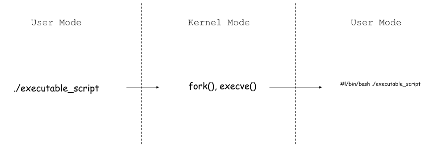

# Introduction

This document tries to understand how bash script loads and execution happened in detail.

## What does Unix loader do?

1. validation(permission, memory requirements etc.);

2. copying the program image from the disk into main memory;

3. copying the command-line arguments oon the stack;

4. initializing registers(e.g. the stack pointer);

5. jumping to the program entry point(_start).

## ELF format 

ELF's first 4 bytes is magic number.

Bash is represented by file signature `#!`.

## Unsolved problmes

- What happens when I execute a command in shell?

- Understand format used for execution on unix-like systems 
  This question for executable script is understanding how script runtime interpret the script

- What is execution context like?

- How execution context is setup based on executable file?

- How the program execution context is setup on Linux ?

# Reference

1. [Loader (computing)](https://en.wikipedia.org/wiki/Loader_(computing))

2. [Understanding the Linux Kernel / Chapter 20 Program Execution ](https://doc.lagout.org/operating%20system%20/linux/Understanding%20Linux%20Kernel.pdf)

3. [Advanced Bash-Scripting Guide](https://tldp.org/LDP/abs/html/)

4. [execve(2) — Linux manual page](https://man7.org/linux/man-pages/man2/execve.2.html)

5. [Unix/Linux Loader Process](https://unix.stackexchange.com/questions/50335/unix-linux-loader-process#answer-50346)

6. [Executable and Linkable Format](https://en.wikipedia.org/wiki/Executable_and_Linkable_Format#File_layout)

7. [List of file signatures](https://en.wikipedia.org/wiki/List_of_file_signatures)

8. [Reverse Engineering | ELF File Format | Beginners](https://www.youtube.com/watch?v=OBDuoqyZ4UA&t=66s)

9. [Understanding the Linux Kernel / Chapter 3 Processes / Create Processes](https://doc.lagout.org/operating%20system%20/linux/Understanding%20Linux%20Kernel.pdf)
