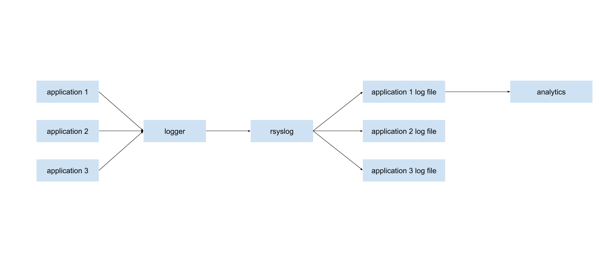

# Steps

- Install rsyslog on CentOS

  - Default log location: `/var/log/messages`

  - Create a simple log: `echo "simple log"| logger `

  - Check if configuration correct: `rsyslogd -f /etc/rsyslog.conf -N1`

- Filter log

    > Filter message with tag and save the message to file with tag in the filename.

    - Prepare testing message

      ``` bash
      # Create a message with tag
      echo "hell world" | logger -i -t hello-world
      ```

- rotate log

- Present log with a UI


# Architecture





# Reference

1. [How to Configure Rsyslog Server in CentOS 8 / RHEL 8](https://www.linuxtechi.com/configure-rsyslog-server-centos-8-rhel-8/)


2. [how to filter rsyslog messages by tags](https://serverfault.com/questions/514901/how-to-filter-rsyslog-messages-by-tags)