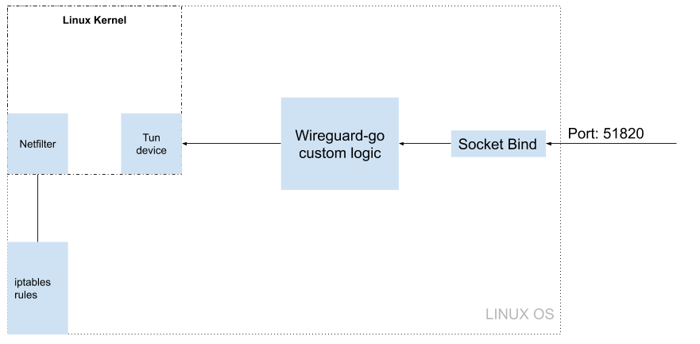

# Introduction

This article focuses on wireguard-go source code dissection. With 3 things in mind:

- Understand the code structure, and low level dependencies

- Extract core data structure and dissect it

- If in the future I need to explain wireguard to somebody, this article should be easily reused

## Understand main components of the codebase

- `wireguard-go/main.go` is the entrypoint of the project.

- `wireguard-go/tun` is responsible for initiation of the virtual network interface

- `wireguard-go/device` is responsible of the virtual network custom logic

## Understand main dataflow 




## Understand virtual network device initiation

1. Create tun device

2. Create unix socket 

3. Listen on unix socket file, put new connection into channel

	This piece of code in `wireguard-go/main.go`, [ref](https://github.com/WireGuard/wireguard-go/blob/a4657f996d98378c06cc7da4d2c69539c19dae32/main.go#L235), puts a listener on the virtual network interface(will use interface for concision purpose).

	``` go
	uapi, err := ipc.UAPIListen(interfaceName, fileUAPI)
	```


	This piece of code in `wireguard-go/ipc/uapi_linux.go`, [ref](https://github.com/WireGuard/wireguard-go/blob/master/ipc/uapi_linux.go#L133-L142), runs a new go routine: 

	- Defines a listner on virtual  network interface

	- Accept new connections from the listener

	- Send connection into `connNew` channel

	``` go
	// ...
	type UAPIListener struct {
		listener        net.Listener // unix socket listener
		connNew         chan net.Conn
		connErr         chan error
		inotifyFd       int
		inotifyRWCancel *rwcancel.RWCancel
	}
	// ...

	func UAPIListen(name string, file *os.File) (net.Listener, error) {

		// wrap file in listener

		listener, err := net.FileListener(file)

		// ...
		// ...

		// watch for new connections

		go func(l *UAPIListener) {
			for {
				conn, err := l.listener.Accept()
				if err != nil {
					l.connErr <- err
					break
				}
				l.connNew <- conn
			}
		}(uapi)

		return uapi, nil
	}
	```

4. Receive connection from channel, and handle the channel

	These two pieces of code in [wireguard-go/main.go](https://github.com/WireGuard/wireguard-go/blob/master/main.go#L241-L250) and [wireguard-go/ipc/uapi_linux.go](https://github.com/WireGuard/wireguard-go/blob/master/ipc/uapi_linux.go#L37-L47)


	- pass the connection received from listener `UAPIListener.listener` through channel `UAPIListener.connNew` to `device.IpcHandle`

	``` go
	// wireguard-go/main.go
	go func() {
		for {
			conn, err := uapi.Accept()
			if err != nil {
				errs <- err
				return
			}
			go device.IpcHandle(conn)
		}
	}()

	// wireguard-go/ipc/uapi_linux.go
	func (l *UAPIListener) Accept() (net.Conn, error) {
		for {
			select {
			case conn := <-l.connNew:
				return conn, nil

			case err := <-l.connErr:
				return nil, err
			}
		}
	}
	```
